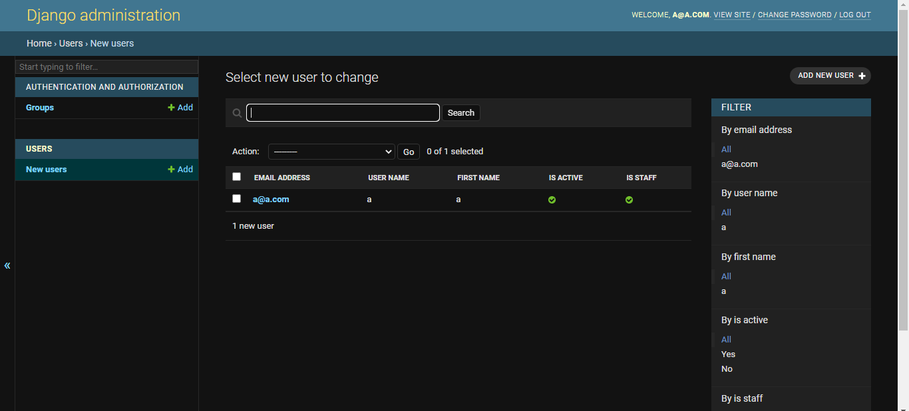
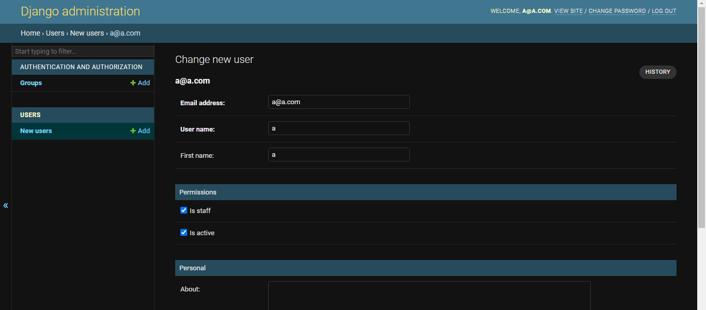
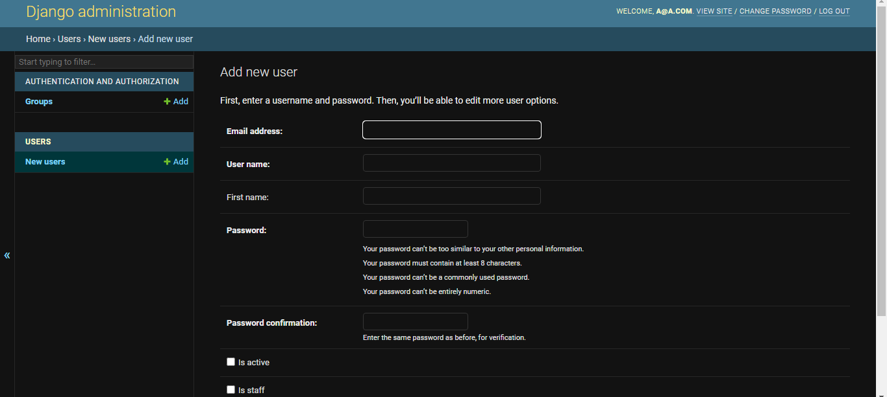

# Custom User Model
> Building Custom user model with extended fields using django

## Table of Contents
* [General Info](#general-information)
* [Technologies Used](#technologies-used)
* [Features](#features)
* [Screenshots](#screenshots)
* [Usage](#usage)
* [Project Status](#project-status)
* [Acknowledgements](#acknowledgements)
* 

## General Information
- This is an app to create custom user model and extended fields.
- I built this project to learn custom user model in django.

## Technologies Used
- Python 3.8.6
- Django 4.0.4

## Features
- It can create custom user model with extdended fields.
- It can use email as username.
- It has a model manager.
- It can customize the django admin interface.
- It has a testing model.

## Screenshots

## Usage

`python manage.py runserver`

## Project Status
Project is: _complete_

## Acknowledgements
- This project was based on [this tutorial](https://www.youtube.com/watch?v=Ae7nc1EGv-A).
- Many thanks to Very Academy YouTube Channel
